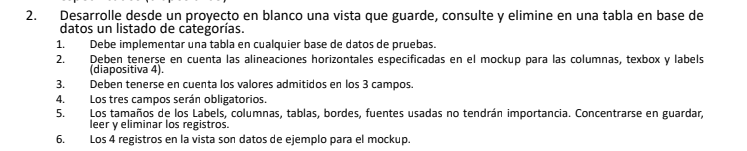
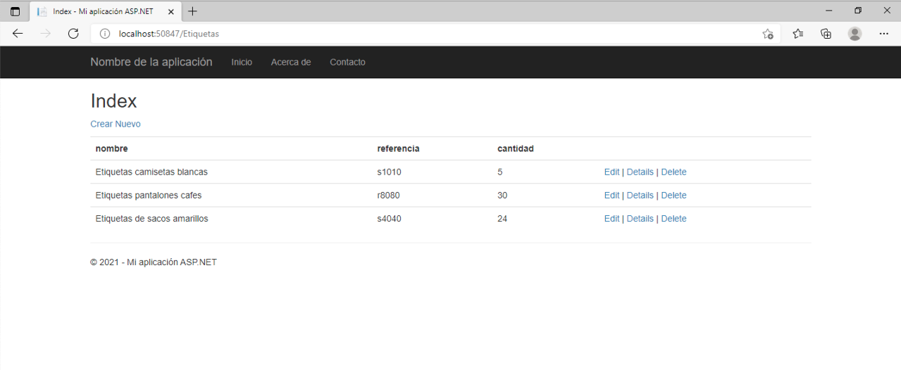
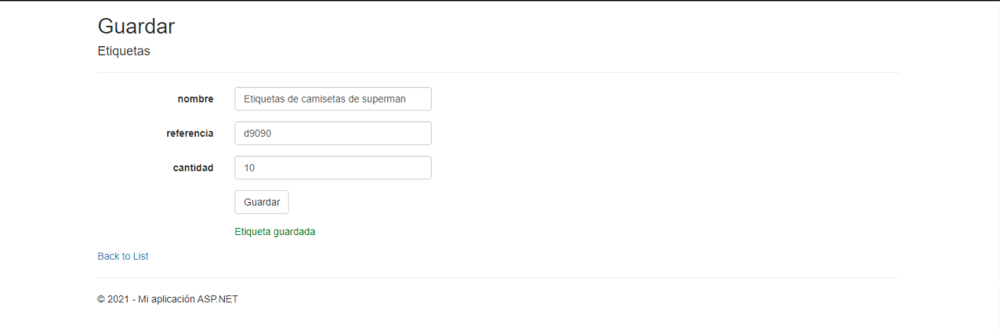
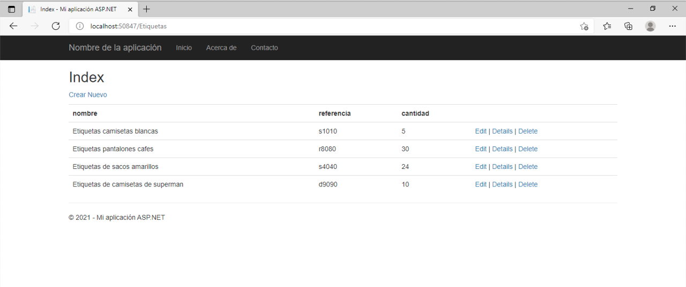
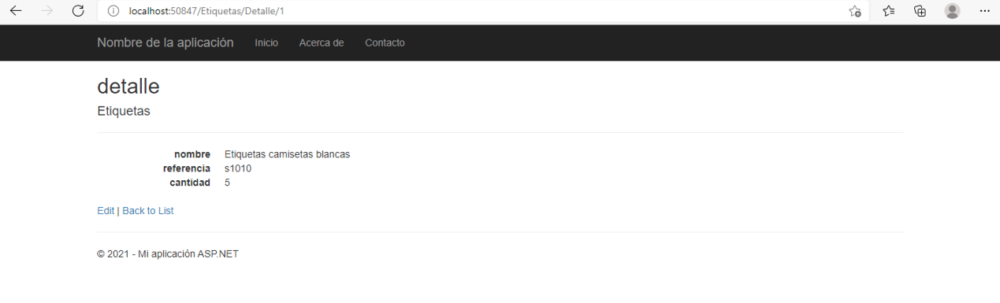
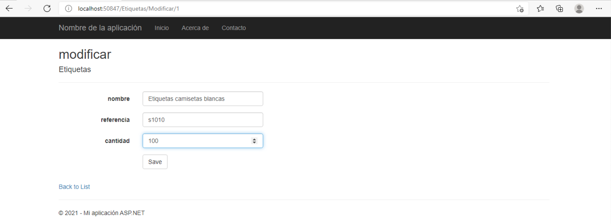
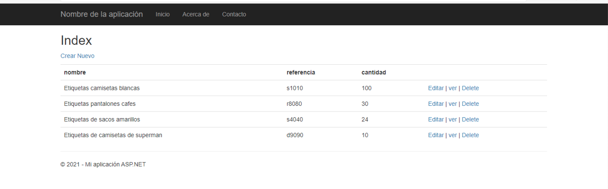

# Punto2_PruebaTecnica_Pangea

## Requerimientos

## Descripción

Se realizo una aplicacion web que permitiera la funcionalidad CRUD(Create, Read, Update, Delete) sobre la entidad "Etiquetas", la cual tenia los siguientes atributos: nombre(texto), referencia (texto), cantidad(numero entero). La aplicacion se desarrollo en la plataforma ASP.NET  con lenguaje C# y Razor (HTML + C#) para el frontend, la aplicacion se estucturo en arquitectura MVC y se conecto a una base de satos SQL por medio del ORM Entity Framework. el desarrollo de la aplicación se realizo en el IDE Visual Estudio 2019.

## Funcionamiento

Se muestra la pantalla inicial con los botones que permiten las funciones CRUD.

El usuario puede elegir la opcion de crear nuevo y se abrira un nuevo formulario donde se podran ingresar los datos de un nuevo elemento

Se muestra la lista de base de datos con un nuevo elemento incorporado

Al elegir la opcion detalle, el programa mostrara en una nueva ventana todos los atributos del elemento consultado.

Al elegir la opcio modificar, se mostrara una nueva vista con los datos del elemento permitiendo al usuario modificar estos datos.

Se confirma al usuario que el elemento se modifico

Se muestra la lista de los elementos de base de datos con los datos del elemento modificado anteriormente de forma actualizada.

Al usuario elegir el boton eliminar que esta en el elemento, este se eliminara de la base de datos, la aplicación lo confirmara y mostrara un vista actualizada sin el elemento eliminado.

